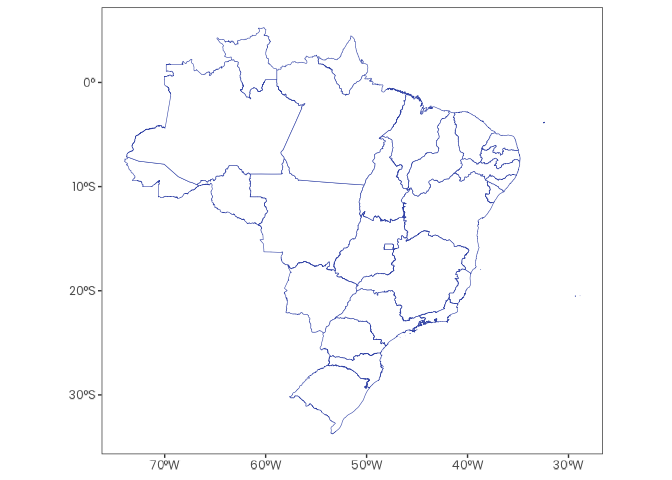
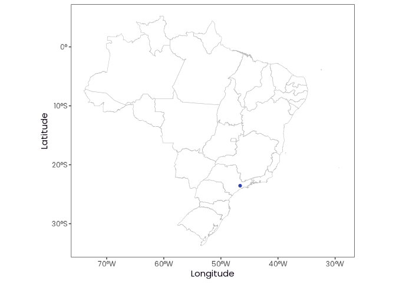

# orbis <a href = "https://danielvartan.github.io/brandr/"></a>

<!-- quarto render -->

<!-- badges: start -->
[](https://www.repostatus.org/#active)
[](https://github.com/danielvartan/orbis/actions)
[](https://app.codecov.io/gh/danielvartan/orbis)
[](https://www.gnu.org/licenses/gpl-3.0)
[](https://fairsoftwarechecklist.net/v0.2/?f=21&a=30112&i=32322&r=123)
[](https://fair-software.eu)
[](https://www.contributor-covenant.org/version/3/0/code_of_conduct/)
<!-- badges: end -->

## Overview

`orbis` is an [R](https://www.r-project.org/) package that provides a
comprehensive suite of tools for streamlining spatial data analysis
workflows. It follows the [tidyverse
principles](https://tidyverse.tidyverse.org/articles/manifesto.html) and
integrates naturally with the [tidyverse
ecosystem](https://www.tidyverse.org/).

> If you find this project useful, please consider giving it a star!  
> [](https://github.com/danielvartan/orbis/)

## Installation

You can install `orbis` using the
[`remotes`](https://github.com/r-lib/remotes) package:

``` r
# install.packages("remotes")
remotes::install_github("danielvartan/orbis", dependencies = TRUE)
```

## Usage

`orbis` is equipped with several functions to help with your analysis,
such as:

- [`shift_and_rotate()`](https://danielvartan.github.io/orbis/reference/shift_and_rotate.html):
  Shift and rotate raster or vector data.
- [`remove_unique_outliers()`](https://danielvartan.github.io/orbis/reference/remove_unique_outliers.html):
  Remove unique outliers from raster files.
- [`map_fill_data()`](https://danielvartan.github.io/orbis/reference/map_fill_data.html):
  Prepare data to fill a map.
- [`filter_points()`](https://danielvartan.github.io/orbis/reference/filter_points.html):
  Filter latitude/longitude points that intersects with a given
  [`sf`](https://r-spatial.github.io/sf/) geometry.
- [`brazil_municipality()`](https://danielvartan.github.io/orbis/reference/brazil_municipality.html):
  Get Brazilian municipalities data.
- [`sidra_download_by_year()`](https://danielvartan.github.io/orbis/reference/sidra_download_by_year.html):
  Download and aggregate data by year from
  [SIDRA](https://sidra.ibge.gov.br/) API (to avoid overloading).
- [`worldclim_download()`](https://danielvartan.github.io/orbis/reference/worldclim_download.html):
  Download [WorldClim](https://worldclim.org/) data.
- [`worldclim_to_ascii()`](https://danielvartan.github.io/orbis/reference/worldclim_to_ascii.html):
  Convert [WorldClim](https://worldclim.org/)
  [GeoTIFF](https://www.ogc.org/standards/geotiff/) files to [Esri
  ASCII](https://desktop.arcgis.com/en/arcmap/latest/manage-data/raster-and-images/esri-ascii-raster-format.htm)
  raster format.

Here are some examples of how to use a few of these functions.

### `shift_and_rotate()`

[`shift_and_rotate()`](https://danielvartan.github.io/orbis/reference/shift_and_rotate.html)
was developed to simplify shifting and rotating spatial data, especially
for rasters and vectors that cross the dateline (e.g. the Russian
territory).

#### Set the Environment

``` r
library(dplyr)
library(geodata)
library(ggplot2)
library(orbis)
library(terra)
library(tidyterra)
```

``` r
plot_vector <- function(vector) {
  plot <-
    vector |>
    ggplot() +
    geom_spatvector(fill = "#3243A6", color = "white")

  print(plot)
}
```

#### Define a World Vector

``` r
world_vector <- world(path = tempdir())
```

#### Visualize the World Vector

``` r
world_vector |> plot_vector()
```


#### Define the Country Vector

``` r
russia_vector <- gadm(country = "rus", level = 0, path = tempdir())
```

#### Visualize the Country Vector

``` r
russia_vector |> plot_vector()
```


#### Shift and Rotate the Country Vector -45 Degrees to the Left

``` r
russia_vector |> shift_and_rotate(-45) |> plot_vector()
```


### `remove_unique_outliers()`

[`remove_unique_outliers()`](https://danielvartan.github.io/orbis/reference/remove_unique_outliers.html)
was developed to simplify the removal of abnormal values in raster
files. It can be used with
[GeoTIFF](https://www.ogc.org/standards/geotiff/) and [Esri
ASCII](https://desktop.arcgis.com/en/arcmap/latest/manage-data/raster-and-images/esri-ascii-raster-format.htm)
raster formats.

#### Set the Environment

``` r
library(orbis)
library(readr)
library(terra)
```

#### Create a Fictional Esri ASCII File

``` r
asc_content <- c(
  "ncols         5",
  "nrows         5",
  "xllcorner     0.0",
  "yllcorner     0.0",
  "cellsize      1.0",
  "NODATA_value  -9999",
  "1 2 3 4 5 ",
  "6 7 8 9 10 ",
  "11 12 1000 14 15 ", # Extreme outlier (1000)
  "16 1 18 19 20 ",
  "21 22 23 24 25 "
)
```

``` r
temp_file <- tempfile(fileext = ".asc")

asc_content |> write_lines(temp_file)
```

#### Visualize Values Before `remove_unique_outliers()`

``` r
temp_file |> rast() |> values(mat = FALSE)
#>  [1]    1    2    3    4    5    6    7    8    9   10   11   12 1000   14
#> [15]   15   16    1   18   19   20   21   22   23   24   25
```

#### Visualize Values After `remove_unique_outliers()`

``` r
temp_file |> remove_unique_outliers()
```

``` r
temp_file |> rast() |> values(mat = FALSE)
#>  [1]  1  2  3  4  5  6  7  8  9 10 11 12 NA 14 15 16  1 18 19 20 21 22 23 24
#> [25] 25
```

### `map_fill_data()`

[`map_fill_data()`](https://danielvartan.github.io/orbis/reference/map_fill_data.html)
was developed to simplify the preparation of data to fill a map.

#### Set the Environment

``` r
library(dplyr)
library(geodata)
library(ggplot2)
library(orbis)
library(terra)
library(tidyterra)
```

``` r
plot_vector_shape <- function(vector) {
  plot <-
    vector |>
    ggplot() +
    geom_spatvector(fill = "white", color = "#3243A6")

  print(plot)
}
```

``` r
plot_vector_data <- function(data, vector) {
  plot <-
    data |>
    ggplot() +
    geom_spatvector(aes(fill = value), color = "white") +
    scale_fill_continuous(
        palette = c("#072359", "#3243A6", "#9483AF"),
        na.value = "white"
    ) +
    labs(fill = NULL)

  print(plot)
}
```

#### Define the Map

``` r
brazil_states_vector <- gadm("BRA", level = 1, path = tempdir())
```

#### Visualize the Map

``` r
brazil_states_vector |> plot_vector_shape()
```



#### Define the Data

``` r
data <- tibble(
  state = sample(brazil_states_vector$NAME_1, size = 1000, replace = TRUE),
  value = sample(1:1000, size = 1000, replace = TRUE)
)
data
#> # A tibble: 1,000 × 2
#>   state              value
#>   <chr>              <int>
#> 1 Minas Gerais         881
#> 2 Mato Grosso do Sul   300
#> 3 Amazonas             778
#> 4 Sergipe              393
#> 5 Acre                 682
#> 6 Roraima              369
#> # ℹ 994 more rows
```

#### Create the Map Fill Data

``` r
data <- data |> map_fill_data(col_fill = "value", col_ref = "state")
#> ! There are duplicated values in state. value will be aggregated using the mean.

data
#> # A tibble: 27 × 2
#>   state              value
#>   <chr>              <dbl>
#> 1 Minas Gerais        581.
#> 2 Mato Grosso do Sul  538.
#> 3 Amazonas            543.
#> 4 Sergipe             464.
#> 5 Acre                546.
#> 6 Roraima             530.
#> # ℹ 21 more rows
```

#### Visualize the Map Fill Data

``` r
brazil_states_vector |>
  left_join(data, by = c("NAME_1" = "state")) |>
  plot_vector_data()
```


### `filter_points()`

[`filter_points()`](https://danielvartan.github.io/orbis/reference/filter_points.html)
was developed to filter latitude/longitude points that intersect with a
given [`sf`](https://r-spatial.github.io/sf/) geometry. This is
particularly useful for removing points that fall in the ocean when
working with country or state boundaries.

#### Set the Environment

``` r
library(dplyr)
library(ggplot2)
library(geobr)
library(orbis)
library(sf)
```

``` r
plot_geometry <- function(geometry) {
  plot <-
    geometry |>
    ggplot() +
    geom_sf(
      color = "gray75",
      fill = "white",
      inherit.aes = FALSE
    ) +
    labs(x = "Longitude", y = "Latitude")

  print(plot)
}
```

``` r
plot_points <- function(data, geometry) {
  plot <-
    data |>
    ggplot(aes(x = longitude, y = latitude)) +
    geom_sf(
      data = geometry,
      color = "gray75",
      fill = "white",
      inherit.aes = FALSE
    ) +
    geom_point(color = "#3243A6") +
    labs(x = "Longitude", y = "Latitude")

  print(plot)
}
```

#### Define the Points

``` r
data <- tibble(
  latitude = brazil_state_latitude(),
  longitude = brazil_state_longitude()
)

data
#> # A tibble: 27 × 2
#>   latitude longitude
#>      <dbl>     <dbl>
#> 1  -9.98       -67.8
#> 2  -9.65       -35.7
#> 3   0.0402     -51.1
#> 4  -3.13       -60.0
#> 5 -13.0        -38.5
#> 6  -3.73       -38.5
#> # ℹ 21 more rows
```

#### Visualize the Points on a Map

``` r
brazil_states_geometry <- read_state()
#> Using year/date 2010
```

``` r
data |> plot_points(brazil_states_geometry)
```


#### Set the Geometry to Filter the Points

``` r
sp_state_geometry <- read_state(code = "SP")
#> Using year/date 2010
```

``` r
sp_state_geometry |> plot_geometry()
```


#### Filter the Points

``` r
data <- data |> filter_points(sp_state_geometry)

data
#> # A tibble: 1 × 2
#>   latitude longitude
#>      <dbl>     <dbl>
#> 1    -23.6     -46.6
```

#### Visualize the Filtered Points

``` r
data |> plot_points(brazil_states_geometry)
```



Click [here](https://danielvartan.github.io/orbis/reference/) to see the
full list of functions.

## Citation

If you use this package in your research, please cite it to acknowledge
the effort put into its development and maintenance. Your citation helps
support its continued improvement.

``` r
citation("orbis")
#> To cite orbis in publications use:
#> 
#>   Vartanian, D. (2025). orbis: Spatial data analysis tools [Computer
#>   software]. https://danielvartan.github.io/orbis
#> 
#> A BibTeX entry for LaTeX users is
#> 
#>   @Misc{,
#>     title = {orbis: Spatial data analysis tools},
#>     author = {Daniel Vartanian},
#>     year = {2025},
#>     url = {https://danielvartan.github.io/orbis},
#>     note = {R package},
#>   }
```

## License

[](https://www.gnu.org/licenses/gpl-3.0)

``` text
Copyright (C) 2025 Daniel Vartanian

orbis is free software: you can redistribute it and/or modify it under the
terms of the GNU General Public License as published by the Free Software
Foundation, either version 3 of the License, or (at your option) any later
version.

This program is distributed in the hope that it will be useful, but WITHOUT ANY
WARRANTY; without even the implied warranty of MERCHANTABILITY or FITNESS FOR A
PARTICULAR PURPOSE. See the GNU General Public License for more details.

You should have received a copy of the GNU General Public License along with
this program. If not, see <https://www.gnu.org/licenses/>.
```

## Contributing

[](https://www.contributor-covenant.org/version/3/0/code_of_conduct/)

Contributions are always welcome! Whether you want to report bugs,
suggest new features, or help improve the code or documentation, your
input makes a difference. Before opening a new issue, please take a
moment to review our [Guidelines for
Contributing](https://danielvartan.github.io/orbis/CONTRIBUTING.html)
and check the [issues tab](https://github.com/danielvartan/orbis/issues)
to see if your topic has already been reported.

[](https://github.com/sponsors/danielvartan)

You can also support the development of `orbis` by becoming a sponsor.
Click [here](https://github.com/sponsors/danielvartan) to make a
donation. Please mention `orbis` in your donation message.
