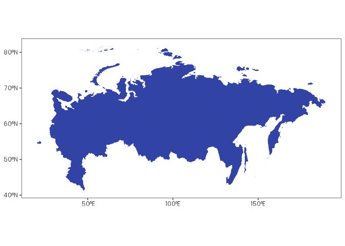

# orbis

## Overview

`orbis` is an [R](https://www.r-project.org/) package with tools to
simplify spatial data analysis. It provides an intuitive interface that
follows [tidyverse
principles](https://tidyverse.tidyverse.org/articles/manifesto.html) and
integrates seamlessly with the [tidyverse
ecosystem](https://tidyverse.org/).

> If you find this project useful, please consider giving it a star!  
> [](https://github.com/danielvartan/orbis/)

> The continuous development of `orbis` depends on community support. If
> you find this project useful, and can afford to do so, please consider
> becoming a sponsor.  
> [](https://github.com/sponsors/danielvartan)

## Installation

You can install `orbis` using the
[`remotes`](https://github.com/r-lib/remotes) package:

``` r
# install.packages("remotes")
remotes::install_github("danielvartan/orbis")
```

## Usage

`orbis` is equipped with several functions to help with your analysis,
such as:

- [`shift_and_rotate()`](https://danielvartan.github.io/orbis/reference/shift_and_rotate.html):
  Shift and rotate a raster or a vector
- [`remove_unique_outliers()`](https://danielvartan.github.io/orbis/reference/remove_unique_outliers.html):
  Remove unique outliers from raster files
- [`sidra_download_by_year()`](https://danielvartan.github.io/orbis/reference/sidra_download_by_year.html):
  Download and aggregate data by year from
  [SIDRA](https://sidra.ibge.gov.br/) API (to avoid overloading)
- [`worldclim_download()`](https://danielvartan.github.io/orbis/reference/worldclim_download.html):
  Download [WorldClim](https://worldclim.org/) data
- [`worldclim_to_ascii()`](https://danielvartan.github.io/orbis/reference/worldclim_to_ascii.html):
  Convert [WorldClim](https://worldclim.org/)
  [GeoTIFF](https://www.ogc.org/standards/geotiff/) files to [Esri
  ASCII](https://desktop.arcgis.com/en/arcmap/latest/manage-data/raster-and-images/esri-ascii-raster-format.htm)
  raster format

Here are some examples of usage.

### `shift_and_rotate()`

[`shift_and_rotate()`](https://danielvartan.github.io/orbis/reference/shift_and_rotate.html)
was developed to simplify shifting and rotating spatial data, especially
for rasters and vectors that cross the [International Date
Line](https://en.wikipedia.org/wiki/International_Date_Line) (e.g. the
Russian territory).

#### Set the Environment

``` r
library(dplyr)
library(geodata)
library(ggplot2)
library(orbis)
library(terra)
library(tidyterra)
```

``` r
plot_vector <- function(vector) {
  plot <-
    vector |>
    ggplot() +
    geom_spatvector(fill = "#3243A6", color = "white")

  print(plot)
}
```

#### Define a World Vector

``` r
world_vector <- world(path = tempdir())
```

#### Visualize the World Vector

``` r
world_vector |> plot_vector()
```


#### Define a Country Vector

``` r
russia_vector <- gadm(country = "rus", level = 0, path = tempdir())
```

#### Visualize the Country Vector

``` r
russia_vector |> plot_vector()
```


#### Shift and Rotate the Country Vector 45 Degrees to the Left

``` r
russia_vector |> shift_and_rotate(-45) |> plot_vector()
```



### `remove_unique_outliers()`

[`remove_unique_outliers()`](https://danielvartan.github.io/orbis/reference/remove_unique_outliers.html)
was developed to simplify the removal of abnormal values in raster
files. It can be used with
[GeoTIFF](https://www.ogc.org/standards/geotiff/) and [Esri
ASCII](https://desktop.arcgis.com/en/arcmap/latest/manage-data/raster-and-images/esri-ascii-raster-format.htm)
raster formats.

#### Set the Environment

``` r
library(orbis)

library(dplyr)
library(readr)
library(stars)
```

#### Create a Fictional Esri ASCII File

``` r
asc_content <- c(
  "ncols         5",
  "nrows         5",
  "xllcorner     0.0",
  "yllcorner     0.0",
  "cellsize      1.0",
  "NODATA_value  -9999",
  "1 2 3 4 5 ",
  "6 7 8 9 10 ",
  "11 12 1000 14 15 ", # Extreme outlier (1000)
  "16 1 18 19 20 ",
  "21 22 23 24 25 "
)
```

``` r
temp_file <- tempfile(fileext = ".asc")

asc_content |> write_lines(temp_file)
```

#### Visualize Values Before `remove_unique_outliers()`

``` r
temp_file |> read_stars() |> pull(1) |> as.vector()
#>  [1]    1    2    3    4    5    6    7    8    9   10   11   12 1000   14
#> [15]   15   16    1   18   19   20   21   22   23   24   25
```

#### Visualize Values After `remove_unique_outliers()`

``` r
temp_file |> remove_unique_outliers()
```

``` r
temp_file |> read_stars() |> pull(1) |> as.vector()
#>  [1]  1  2  3  4  5  6  7  8  9 10 11 12 NA 14 15 16  1 18 19 20 21 22 23 24
#> [25] 25
```

Click [here](https://danielvartan.github.io/orbis/reference/) to see the
full list of functions.

## Citation

If you use this package in your research, please cite it to acknowledge
the effort put into its development and maintenance. Your citation helps
support its continued improvement.

``` r
citation("orbis")
#> To cite orbis in publications use:
#> 
#>   Vartanian, D. (2026). orbis: Spatial data analysis tools [Computer
#>   software]. https://danielvartan.github.io/orbis
#> 
#> A BibTeX entry for LaTeX users is
#> 
#>   @Misc{,
#>     title = {orbis: Spatial data analysis tools},
#>     author = {Daniel Vartanian},
#>     year = {2026},
#>     url = {https://danielvartan.github.io/orbis},
#>     note = {R package},
#>   }
```

## License

[](https://www.gnu.org/licenses/gpl-3.0)

``` text
Copyright (C) 2025 Daniel Vartanian

orbis is free software: you can redistribute it and/or modify it under the
terms of the GNU General Public License as published by the Free Software
Foundation, either version 3 of the License, or (at your option) any later
version.

This program is distributed in the hope that it will be useful, but WITHOUT ANY
WARRANTY; without even the implied warranty of MERCHANTABILITY or FITNESS FOR A
PARTICULAR PURPOSE. See the GNU General Public License for more details.

You should have received a copy of the GNU General Public License along with
this program. If not, see <https://www.gnu.org/licenses/>.
```

## Contributing

[](https://www.contributor-covenant.org/version/3/0/code_of_conduct/)

Contributions are always welcome! Whether you want to report bugs,
suggest new features, or help improve the code or documentation, your
input makes a difference.

Before opening a new issue, please check the [issues
tab](https://github.com/danielvartan/orbis/issues) to see if your topic
has already been reported.

[](https://github.com/sponsors/danielvartan)

You can also support the development of `orbis` by becoming a sponsor.

Click [here](https://github.com/sponsors/danielvartan) to make a
donation. Please mention `orbis` in your donation message.
